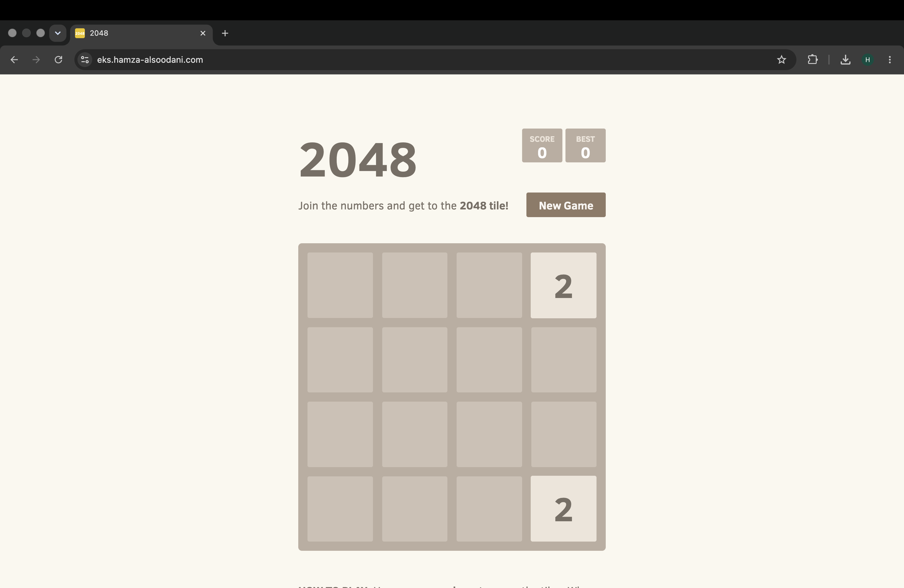
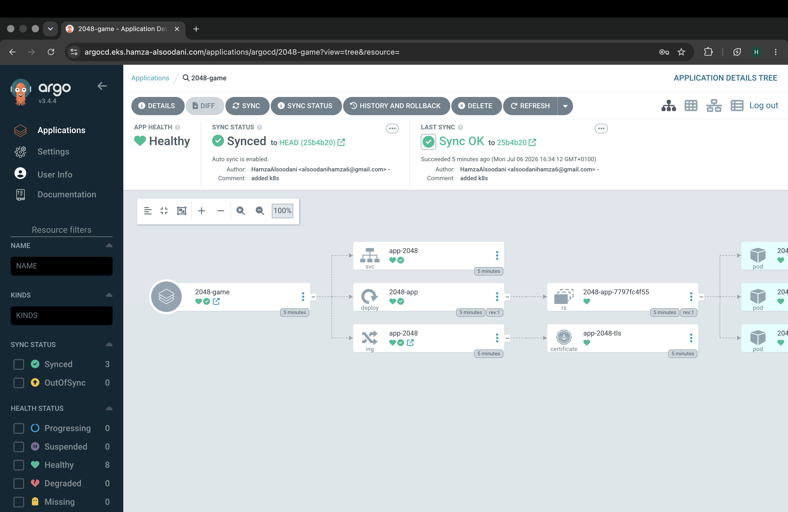
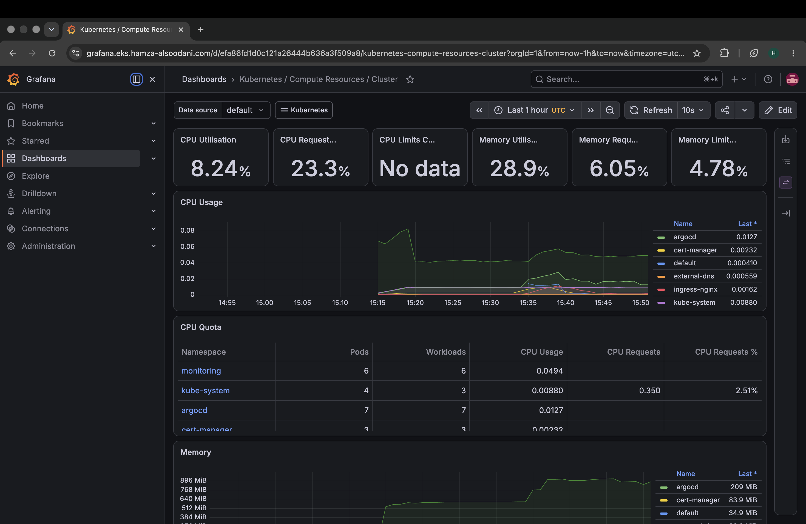
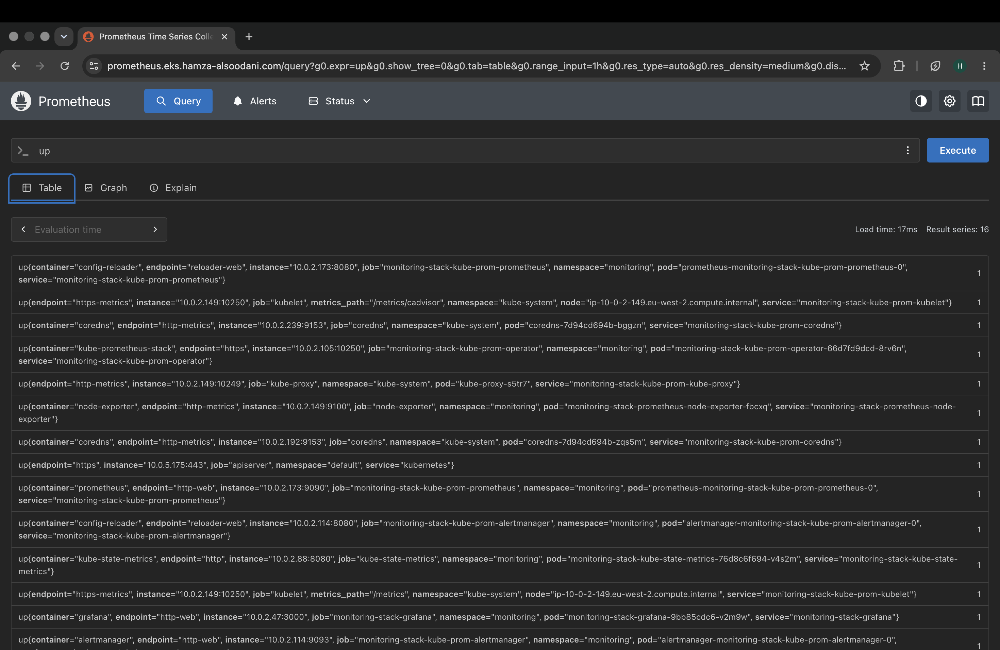

# Production-Grade EKS Deployment on AWS

A containerised web application deployed to a production grade Amazon EKS cluster, provisioned entirely with Terraform and delivered through GitOps. The application is served over HTTPS with certificates issued automatically, DNS records managed dynamically, and the cluster fully observable through Prometheus and Grafana.

## Table of Contents

- [Overview](#overview)
- [Tools Used](#tools-used)
- [Architecture](#architecture)
- [Key Features](#key-features)
- [Directory Structure](#directory-structure)
- [Prerequisites](#prerequisites)
- [Deployment](#deployment)
- [Accessing the Services](#accessing-the-services)
- [Screenshots](#screenshots)
- [Teardown](#teardown)

## Overview

This project provisions and deploys a containerised web application onto a production grade Amazon EKS cluster. All AWS infrastructure is defined as code with Terraform using reusable modules and remote state. Platform components are installed with Helm, application delivery is automated with ArgoCD, TLS certificates are provisioned automatically by CertManager, and DNS records are kept in sync by ExternalDNS. Cluster and application metrics are collected by Prometheus and visualised in Grafana.

The worker nodes run in private subnets with no direct exposure to the internet. Inbound traffic reaches the application through a single public load balancer fronting the NGINX Ingress Controller, which routes requests by hostname and terminates TLS.

## Tools Used

- **AWS:** Cloud provider. EKS runs the cluster, ECR stores the container image, Route 53 manages DNS, the VPC isolates workloads, and S3 with DynamoDB backs the Terraform remote state.
- **Terraform:** Provisions all AWS infrastructure (VPC, EKS, IAM, IRSA, security groups) using reusable modules and remote, locked state.
- **Docker:** Packages the application into a small, portable container image that is stored in Amazon ECR.
- **Kubernetes and Helm:** Kubernetes orchestrates the workloads. Helm installs the platform components (NGINX Ingress, CertManager, ExternalDNS, ArgoCD, Prometheus and Grafana).
- **ArgoCD:** GitOps controller that continuously reconciles the cluster with the manifests stored in this repository. Any change pushed to Git is applied automatically.
- **CertManager and Let's Encrypt:** Issue and renew TLS certificates automatically using the DNS01 challenge through Route 53.
- **ExternalDNS:** Watches Ingress resources and keeps Route 53 records aligned with the live application endpoints.
- **NGINX Ingress Controller:** Routes external traffic to the correct service by hostname and terminates HTTPS.
- **Checkov and Trivy:** Security scanning. Checkov analyses the Terraform for misconfigurations and Trivy scans the container image for vulnerabilities before deployment.
- **Prometheus and Grafana:** Observability. Prometheus scrapes metrics from nodes, pods and cluster components, and Grafana presents them through dashboards.
- **GitHub Actions:** Runs the CI/CD pipelines. One pipeline provisions infrastructure with Terraform, and another builds the image, runs security scans, pushes to ECR, and updates the deployment.

## Architecture


At a high level, a request flows through the stack as follows. A user request for the application hostname resolves through Route 53 (managed by ExternalDNS) to the public load balancer. The load balancer forwards traffic to the NGINX Ingress Controller, which terminates TLS using a certificate issued by CertManager and routes the request to the application service. The service load balances across the application pods running on private worker nodes. ArgoCD keeps those pods in step with the manifests in Git, while Prometheus and Grafana observe the whole cluster.

## Key Features

- Infrastructure as code with remote, locked Terraform state in S3 and DynamoDB.
- Private worker nodes with a single public load balancer, following least privilege networking.
- IRSA (IAM Roles for Service Accounts), so pods assume tightly scoped AWS roles without static credentials.
- Automated HTTPS with Let's Encrypt certificates issued through the Route 53 DNS01 challenge.
- Dynamic DNS driven by the live state of the cluster.
- GitOps delivery, so the cluster state always matches the desired state defined in Git.
- Full observability with Prometheus metrics and Grafana dashboards.
- Security scanning of both infrastructure and container images inside the CI pipelines.

## Directory Structure

```
EKS-Project/
├── .github/
│   └── workflows/            # CI/CD pipelines (Terraform, build, scan, deploy)
├── argocd/
│   └── application.yaml      # ArgoCD Application that deploys the app from k8s/
├── cert-manager/
│   └── cluster-issuer.yaml   # Let's Encrypt ClusterIssuers (production and staging)
├── helm-values/              # Values for the platform Helm releases
│   ├── argo-cd.yaml
│   ├── cert-manager.yaml
│   ├── external-dns.yaml
│   ├── monitoring.yaml
│   └── nginx-ingress.yaml
├── infra/                    # Terraform configuration
│   ├── modules/
│   │   └── vpc/
│   ├── eks.tf
│   ├── vpc.tf
│   ├── irsa.tf
│   ├── helm.tf
│   ├── providers.tf
│   └── locals.tf
├── k8s/                      # Application manifests reconciled by ArgoCD
│   ├── deployment.yaml
│   ├── service.yaml
│   └── ingress.yaml
├── Dockerfile
└── .dockerignore
```

## Prerequisites

- AWS CLI, configured with credentials for the target account.
- Terraform version 1.5 or later.
- kubectl.
- Helm 3.
- Docker.

## Deployment

### 1. Remote state

The Terraform backend uses an S3 bucket for state and a DynamoDB table for state locking. Both must exist before initialising the infrastructure.

### 2. Provision the infrastructure

```
cd infra
terraform init
terraform plan
terraform apply
```

This creates the VPC, the EKS cluster and node group, the IAM and IRSA roles, and installs the platform components with Helm.

### 3. Configure kubectl

```
aws eks update-kubeconfig --region eu-west-2 --name eks-2048
```

### 4. Apply the certificate issuer and the ArgoCD application

```
kubectl apply -f cert-manager/cluster-issuer.yaml
kubectl apply -f argocd/application.yaml
```

ArgoCD then reconciles the manifests in `k8s/` and deploys the application. ExternalDNS creates the Route 53 records and CertManager issues the TLS certificate automatically.

### 5. Build and push the image

The container image is built and pushed to ECR by the CI pipeline on each change. To build it manually:

```
docker build --platform linux/amd64 -t <account>.dkr.ecr.eu-west-2.amazonaws.com/app-2048:v1.0.0 .
docker push <account>.dkr.ecr.eu-west-2.amazonaws.com/app-2048:v1.0.0
```

## Accessing the Services

Once DNS has propagated and certificates are issued, the services are reachable over HTTPS:

- Application: `https://eks.hamza-alsoodani.com`
- ArgoCD: `https://argocd.eks.hamza-alsoodani.com`
- Grafana: `https://grafana.eks.hamza-alsoodani.com`
- Prometheus: `https://prometheus.eks.hamza-alsoodani.com`

Before DNS and certificates are ready, any service can be reached locally with a port forward, for example:

```
kubectl port-forward svc/argocd-server -n argocd 8080:443
```

## Screenshots

### 2048 application served over HTTPS



### ArgoCD: application synced and healthy



### Grafana: cluster dashboards



### Prometheus: scrape targets



## Teardown

Delete the load balancer services first, so the AWS load balancer is removed before the VPC is destroyed:

```
kubectl delete svc --all-namespaces --field-selector spec.type=LoadBalancer
```

Wait for the load balancer to be removed, then destroy the infrastructure:

```
cd infra
terraform destroy
```
